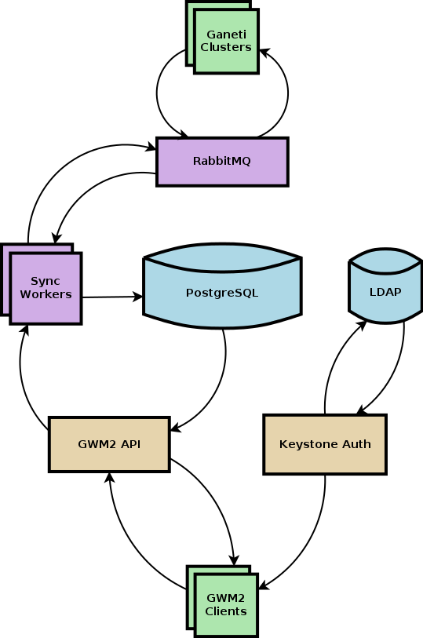

.. GWM Redesign documentation master file, created by
   sphinx-quickstart on Tue Oct  7 11:05:20 2014.
   You can adapt this file completely to your liking, but it should at least
   contain the root `toctree` directive.

GWM Redesign
============

Ganeti Web Manager is a home-grown project from the Oregon State
University Open Source Lab for managing Ganeti clusters.

This document describe plans for a redesigned and rewritten GWM.

Infrastructure
--------------

Django
    Used to implement the HTTP API. Only outputs JSON data.

PostgreSQL
    Relational datastore to hold Ganeti cluster, instance, node, and job data.

Celery
    Asynchronous Job workers for updating the PostgreSQL database with
    Ganeti information.

RabbitMQ
    Job queue manager which acts as the mediary between celery workers
    and Ganeti clusters.

Keystone Auth
    Authorization provider that can talk to optional LDAP backend.
    Provides tokens to application for talking to the HTTP API.

